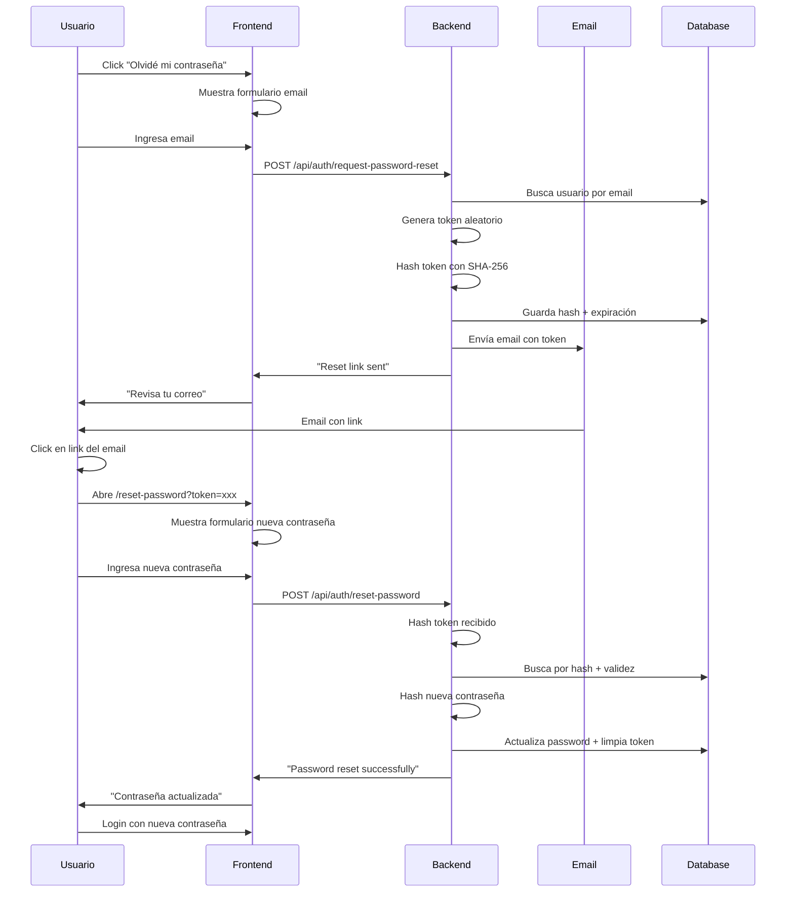
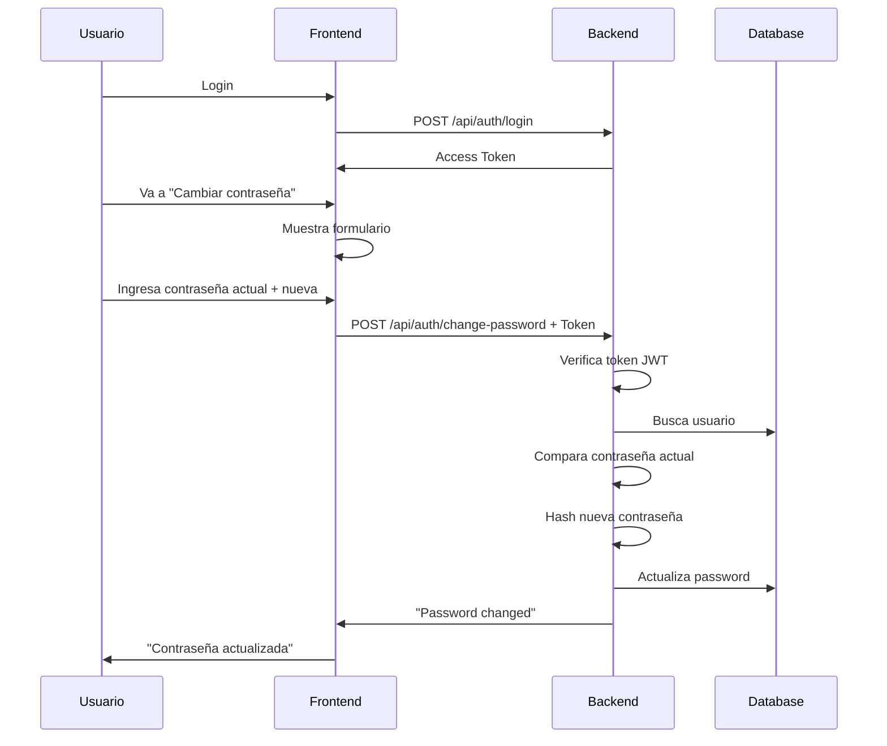

# 🔐 Flujo de Gestión de Contraseñas

Este documento describe la implementación completa del sistema de cambio y recuperación de contraseñas.

---

## 📋 Funcionalidades Implementadas

### 1️⃣ Cambio de Contraseña (Autenticado)

**Endpoint:** `POST /api/auth/change-password`

Permite a usuarios autenticados cambiar su contraseña actual.

#### Request

```json
{
  "currentPassword": "oldpassword123",
  "newPassword": "newpassword123"
}
```

#### Headers

```
Authorization: Bearer <access_token>
```

#### Validaciones

- ✅ Usuario debe estar autenticado
- ✅ Contraseña actual debe ser correcta
- ✅ Nueva contraseña mínimo 6 caracteres
- ✅ Campos requeridos: `currentPassword`, `newPassword`

#### Response Success (200)

```json
{
  "status": "success",
  "data": {
    "message": "Password changed successfully"
  }
}
```

#### Errores

- `400` - Contraseña actual incorrecta
- `401` - No autenticado
- `404` - Usuario no encontrado

---

### 2️⃣ Solicitar Recuperación de Contraseña

**Endpoint:** `POST /api/auth/request-password-reset`

Envía un correo electrónico con un token de recuperación.

#### Request

```json
{
  "email": "user@example.com"
}
```

#### Proceso

1. ✅ Genera token aleatorio de 32 bytes (64 caracteres hex)
2. ✅ Hash del token con SHA-256 antes de almacenar
3. ✅ Token válido por **1 hora**
4. ✅ Envía email con enlace al frontend
5. ✅ No revela si el email existe (seguridad)

#### Response Success (200)

```json
{
  "status": "success",
  "data": {
    "message": "If the email exists, a reset link has been sent"
  }
}
```

#### Email Enviado

- **Subject:** "Recuperación de Contraseña - C3M Centralia"
- **Contenido:** Template HTML profesional con:
  - Botón para restablecer contraseña
  - Enlace directo (por si el botón no funciona)
  - Advertencias de seguridad
  - Tiempo de expiración (1 hora)

**URL generada:**

```
{FRONTEND_URL}/reset-password?token={resetToken}
```

#### Campos en Base de Datos

```typescript
{
  resetPasswordToken: string; // Hash SHA-256 del token
  resetPasswordExpires: Date; // Timestamp + 1 hora
}
```

---

### 3️⃣ Validar Token de Recuperación

**Endpoint:** `GET /api/auth/validate-reset-token?token={token}`

Valida un token de recuperación antes de mostrar el formulario de cambio de contraseña.

#### Query Parameters

```
token: string (requerido) - Token de recuperación del email
```

#### Proceso

1. ✅ Hash del token recibido con SHA-256
2. ✅ Busca usuario con token válido y no expirado
3. ✅ Retorna información básica del usuario (nombre, email)
4. ✅ No modifica nada en la base de datos

#### Response Success (200)

```json
{
  "status": "success",
  "data": {
    "valid": true,
    "user": {
      "name": "John Doe",
      "email": "john@example.com"
    }
  }
}
```

#### Errores

- `400` - Token inválido, expirado o no proporcionado
- `400` - "Invalid or expired reset token"

#### Seguridad

- ✅ Solo expone nombre y email (datos no sensibles)
- ✅ No revela contraseña ni tokens
- ✅ Valida expiración (< 1 hora)

---

### 4️⃣ Restablecer Contraseña

**Endpoint:** `POST /api/auth/reset-password`

Restablece la contraseña usando el token del email.

#### Request

```json
{
  "token": "a1b2c3d4...x4y5z6",
  "newPassword": "newpassword123"
}
```

#### Validaciones

- ✅ Token debe existir en la base de datos
- ✅ Token no debe estar expirado (< 1 hora)
- ✅ Nueva contraseña mínimo 6 caracteres
- ✅ Token solo puede usarse **una vez**

#### Response Success (200)

```json
{
  "status": "success",
  "data": {
    "message": "Password reset successfully"
  }
}
```

#### Proceso

1. ✅ Hash del token recibido con SHA-256
2. ✅ Busca usuario con token válido y no expirado
3. ✅ Actualiza contraseña con bcrypt
4. ✅ **Limpia** `resetPasswordToken` y `resetPasswordExpires`
5. ✅ Token queda invalidado automáticamente

#### Errores

- `400` - Token inválido o expirado
- `400` - Validación de contraseña

---

## 🔒 Seguridad

### Tokens de Recuperación

- **Generación:** `crypto.randomBytes(32)` → 64 caracteres hexadecimales
- **Almacenamiento:** Hash SHA-256 (nunca el token original)
- **Expiración:** 1 hora automática
- **Uso único:** El token se elimina después del primer uso
- **No reutilizable:** Incluso si se guarda, no funcionará

### Contraseñas

- **Hashing:** bcrypt con salt
- **Validación:** Mínimo 6 caracteres
- **Verificación:** Comparación segura con bcrypt

### Privacidad

- No revela si un email existe en el sistema
- Siempre retorna mensaje genérico en solicitud de reset
- Tokens hasheados antes de almacenar

---

## 📧 Configuración de Email

### Variables de Entorno Requeridas

```env
# SMTP Configuration
SMTP_HOST=smtp.gmail.com
SMTP_PORT=587
SMTP_SECURE=false
SMTP_USER=your-email@gmail.com
SMTP_PASS=your-app-password

# From Information
SMTP_FROM_NAME=C3M Software Solutions
SMTP_FROM_EMAIL=noreply@c3mcentral.com

# Frontend URL (para links en emails)
FRONTEND_URL=http://localhost:3000
```

### Proveedores Soportados

- ✅ Gmail (con App Password)
- ✅ SendGrid
- ✅ Mailgun
- ✅ Cualquier SMTP estándar

### Degradación Graceful

Si el email no está configurado:

- ⚠️ Log de advertencia en consola
- ✅ El sistema sigue funcionando
- ❌ No se envían emails (útil para desarrollo)

---

## 🧪 Testing

### Cobertura de Tests

**Archivo:** `tests/integration/auth/password.test.ts`

#### Cambio de Contraseña (5 tests)

- ✅ Cambio exitoso con credenciales válidas
- ✅ Falla con contraseña actual incorrecta
- ✅ Falla sin autenticación
- ✅ Falla con contraseña < 6 caracteres
- ✅ Falla sin campos requeridos

#### Solicitud de Reset (5 tests)

- ✅ Acepta email válido y genera token
- ✅ Retorna success para email inexistente (seguridad)
- ✅ Falla sin email
- ✅ Falla con formato de email inválido
- ✅ Genera tokens únicos en múltiples solicitudes

#### Restablecer Contraseña (6 tests)

- ✅ Reset exitoso con token válido
- ✅ Falla con token inválido
- ✅ Falla con token expirado
- ✅ Falla con contraseña < 6 caracteres
- ✅ Falla sin campos requeridos
- ✅ No permite reutilizar token

#### Validar Token (5 tests)

- ✅ Valida token válido y retorna datos de usuario
- ✅ Falla con token inválido
- ✅ Falla con token expirado
- ✅ Falla sin parámetro token
- ✅ No expone datos sensibles del usuario

**Total:** 21 tests pasando ✅

---

## 📱 Flujo del Usuario

### Escenario 1: Usuario Olvida su Contraseña



### Escenario 2: Usuario Cambia su Contraseña



---

## 🗄️ Modelo de Datos

### User Schema - Nuevos Campos

```typescript
interface IUser extends Document {
  // ... campos existentes
  resetPasswordToken?: string; // Hash SHA-256 del token
  resetPasswordExpires?: Date; // Timestamp de expiración
}
```

### Indexes

```typescript
// Campos con select: false (no se devuelven por defecto)
resetPasswordToken: {
  select: false;
}
resetPasswordExpires: {
  select: false;
}
```

---

## 🔧 Archivos Modificados

### Modelos

- ✅ `src/models/User.ts` - Agregado `resetPasswordToken` y `resetPasswordExpires`

### Servicios

- ✅ `src/services/authService.ts` - Agregado:
  - `changePassword(userId, currentPassword, newPassword)`
  - `requestPasswordReset(email)`
  - `resetPassword(token, newPassword)`
  - `validateResetToken(token)` - Valida token y retorna datos de usuario

- ✅ `src/services/notificationService.ts` - Agregado:
  - `sendPasswordResetEmail(email, name, resetToken)`
  - `getPasswordResetTemplate(name, resetUrl)`

### Controladores

- ✅ `src/controllers/authController.ts` - Agregado:
  - `changePassword`
  - `requestPasswordReset`
  - `resetPassword`
  - `validateResetToken` - Endpoint de validación

### Rutas

- ✅ `src/routes/authRoutes.ts` - Agregado:
  - `POST /api/auth/change-password` (requiere auth)
  - `POST /api/auth/request-password-reset` (público)
  - `POST /api/auth/reset-password` (público)
  - `GET /api/auth/validate-reset-token` (público) - Valida antes de mostrar formulario

### Tests

- ✅ `tests/integration/auth/password.test.ts` - 21 tests

### Documentación

- ✅ Swagger actualizado con los 4 endpoints
- ✅ `swagger-spec.json` regenerado

---

## 🎨 Páginas Estáticas HTML

### Página de Restablecimiento de Contraseña

El sistema incluye una página HTML estática en `public/reset-password.html` para restablecer la contraseña.

**URL:** `http://localhost:5000/reset-password.html?token=xxx`

#### Flujo Completo:

1. **Usuario olvida contraseña** → Abre app móvil
2. **App móvil** → Llama `POST /api/auth/request-password-reset { email }`
3. **Backend** → Genera token y envía email con enlace
4. **Email** → Usuario recibe link: `http://backend.com/reset-password.html?token=xxx`
5. **Usuario** → Click en enlace, abre página HTML
6. **Página HTML** → Muestra "Validando enlace..." (loading)
7. **Página HTML** → Llama `GET /api/auth/validate-reset-token?token=xxx`
8. **Backend** → Valida token y retorna datos básicos (nombre, email)
9. **Página HTML** → Si token válido: Muestra "¡Hola {nombre}!" + formulario
10. **Página HTML** → Si token inválido/expirado: Muestra error y deshabilita formulario
11. **Usuario** → Ingresa nueva contraseña (solo si token válido)
12. **Página HTML** → Llama `POST /api/auth/reset-password { token, newPassword }`
13. **Backend** → Valida token nuevamente y actualiza contraseña
14. **Página HTML** → Muestra éxito, usuario vuelve a app

#### Características:

```html
✅ Validación de token ANTES de mostrar formulario ✅ Saludo personalizado ("¡Hola {nombre}!") ✅
Estado de loading mientras valida ✅ Diseño responsive moderno ✅ Validación en tiempo real ✅
Indicador de fortaleza (débil/media/fuerte) ✅ Toggle show/hide password (👁️) ✅ Requisitos visuales
✅ Confirmación de contraseña ✅ Manejo de token expirado/inválido ✅ Pantalla de éxito ✅ Sin
dependencias externas (CSS inline)
```

### Configuración del Email

El backend detecta automáticamente la URL correcta:

```typescript
// Si FRONTEND_URL no está configurado → usa páginas estáticas del backend
const backendUrl = `http://localhost:${process.env.PORT || 5000}`;
const resetUrl = `${backendUrl}/reset-password.html?token=${resetToken}`;

// Email enviará link a la página estática del backend
```

### Uso en Producción

La página está lista para producción:

```bash
# Producción
https://tu-api.com/reset-password.html?token=xxx

# No requiere build ni dependencias adicionales
# Todo el CSS y JavaScript está inline
```

---

## 🚀 Uso en Frontend

### Ejemplo: Solicitar Reset

```typescript
// Frontend - Request Password Reset
const requestPasswordReset = async (email: string) => {
  try {
    const response = await fetch('/api/auth/request-password-reset', {
      method: 'POST',
      headers: { 'Content-Type': 'application/json' },
      body: JSON.stringify({ email }),
    });

    const data = await response.json();

    if (data.status === 'success') {
      // Mostrar mensaje: "Revisa tu correo"
      return true;
    }
  } catch (error) {
    console.error('Error:', error);
  }
};
```

### Ejemplo: Reset Password

```typescript
// Frontend - Reset Password
const resetPassword = async (token: string, newPassword: string) => {
  try {
    const response = await fetch('/api/auth/reset-password', {
      method: 'POST',
      headers: { 'Content-Type': 'application/json' },
      body: JSON.stringify({ token, newPassword }),
    });

    const data = await response.json();

    if (data.status === 'success') {
      // Redirigir a login
      router.push('/login');
    } else {
      // Mostrar error: token inválido o expirado
      setError(data.message);
    }
  } catch (error) {
    console.error('Error:', error);
  }
};
```

### Ejemplo: Change Password

```typescript
// Frontend - Change Password (requiere autenticación)
const changePassword = async (currentPassword: string, newPassword: string) => {
  const token = localStorage.getItem('accessToken');

  try {
    const response = await fetch('/api/auth/change-password', {
      method: 'POST',
      headers: {
        'Content-Type': 'application/json',
        Authorization: `Bearer ${token}`,
      },
      body: JSON.stringify({ currentPassword, newPassword }),
    });

    const data = await response.json();

    if (data.status === 'success') {
      // Mostrar mensaje: "Contraseña actualizada"
      return true;
    } else {
      // Mostrar error
      setError(data.message);
    }
  } catch (error) {
    console.error('Error:', error);
  }
};
```

---

## ✅ Checklist de Implementación

### Backend

- [x] Modelo User actualizado con campos de reset
- [x] AuthService: métodos de cambio y reset
- [x] NotificationService: template de email
- [x] AuthController: endpoints implementados
- [x] AuthRoutes: rutas configuradas
- [x] Validaciones con express-validator
- [x] 21 tests de integración pasando
- [x] Swagger documentado
- [x] swagger-spec.json actualizado

### Páginas Estáticas (HTML)

- [x] Página "reset-password.html" (Restablecer con token)
- [x] Diseño responsive y moderno
- [x] Validaciones en tiempo real
- [x] Indicador de fortaleza de contraseña
- [x] Toggle show/hide password
- [x] Mensajes de éxito/error animados
- [x] Loading states
- [x] Integración completa con API
- [x] Manejo de token expirado

**URL Disponible:**

- `http://localhost:5000/reset-password.html?token=xxx` - Restablecer contraseña

**Nota:** La app móvil se encarga de llamar `POST /api/auth/request-password-reset` y el backend envía el email con el enlace a la página estática.

### Frontend React/Vue/Angular (Opcional)

- [ ] Componente "Olvidé mi contraseña"
- [ ] Componente "Restablecer contraseña"
- [ ] Formulario "Cambiar contraseña" (perfil)
- [ ] Integración con estado global
- [ ] Routing

**Nota:** Las páginas estáticas HTML son totalmente funcionales y pueden usarse en producción. El frontend SPA es opcional.

---

## 📊 Estadísticas

- **Tests Totales:** 374 ✅
- **Tests Nuevos:** 16 ✅
- **Coverage:** Password flow 100%
- **Endpoints Nuevos:** 3
- **Archivos Modificados:** 7
- **Archivos Creados:** 2
- **Líneas de Código:** ~500

---

## 🔍 Troubleshooting

### Email no se envía

1. Verificar variables SMTP en `.env`
2. Para Gmail: usar App Password, no contraseña normal
3. Verificar logs en consola
4. Si no hay SMTP configurado, el sistema funciona pero no envía emails

### Token inválido o expirado

- El token expira en 1 hora
- Solo puede usarse una vez
- Solicitar nuevo reset si expira

### Contraseña actual incorrecta

- Verificar que el usuario ingresó la contraseña correcta
- La validación es case-sensitive

---

## 📝 Notas Adicionales

### Variables de Entorno

Asegurarse de que `.env` incluya:

```env
FRONTEND_URL=http://localhost:3000  # URL del frontend
```

### Seguridad

- Tokens hasheados con SHA-256
- Contraseñas hasheadas con bcrypt
- Expiración automática de tokens
- No revelar existencia de emails
- Un solo uso por token

### Producción

- Configurar SMTP real (no Gmail personal)
- Actualizar `FRONTEND_URL` a dominio real
- Verificar que emails lleguen correctamente
- Monitorear logs de errores de email

---

**Implementado por:** C3M Software Solutions  
**Fecha:** Noviembre 2024  
**Versión:** 1.0.0
